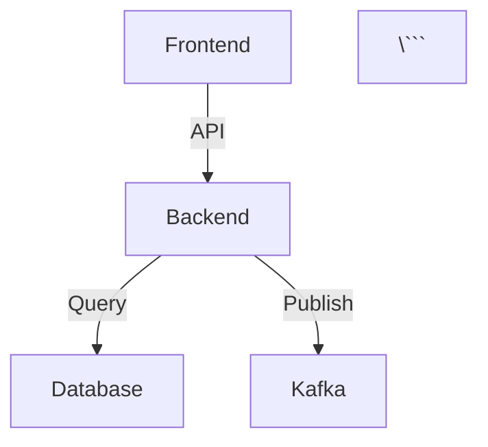

# Initialize Documentation Site

Initialize a Docusaurus documentation site with spec-driven documentation structure, living docs integration, and SpecWeave-optimized configuration.

## Usage

```
/sw-docs:init [options]
```

## What I Do

1. **Scaffold Docusaurus Site**: Create standard Docusaurus 3.x structure
2. **Configure Plugins**: Set up Mermaid diagrams, search, versioning
3. **SpecWeave Integration**: Link to `.specweave/docs/` living documentation
4. **Theme Customization**: Apply professional theme with dark mode
5. **Sidebar Generation**: Auto-generate sidebar from directory structure

## Options

- `--template <template>` - Template type: classic, material, custom (default: classic)
- `--typescript` - Use TypeScript configuration (default: true)
- `--mermaid` - Enable Mermaid diagram support (default: true)
- `--search` - Add Algolia DocSearch or local search (default: local)
- `--versioning` - Enable documentation versioning (default: false)
- `--output <path>` - Output directory (default: `./docs-site`)

## Generated Structure

```
docs-site/
├── docs/                    # Documentation content
│   ├── intro.md
│   ├── features/
│   ├── api/
│   └── guides/
├── blog/                    # Optional blog
├── src/
│   ├── components/         # React components
│   ├── css/               # Custom styles
│   └── pages/             # Custom pages
├── static/                # Static assets
│   ├── img/
│   └── diagrams/
├── docusaurus.config.ts   # Main configuration
├── sidebars.ts            # Sidebar configuration
├── package.json
└── tsconfig.json
```

## SpecWeave Integration

### Living Docs Auto-Sync

Automatically imports content from `.specweave/docs/`:

```typescript
// docusaurus.config.ts
module.exports = {
  plugins: [
    [
      '@docusaurus/plugin-content-docs',
      {
        id: 'specweave-docs',
        path: '../.specweave/docs',
        routeBasePath: 'specweave',
        sidebarPath: './sidebars.ts',
      },
    ],
  ],
};
```

### Architecture Diagrams

Mermaid integration for `.specweave/docs/architecture/`:

```markdown
# System Architecture



### API Documentation

OpenAPI/Swagger integration:

```typescript
// docusaurus.config.ts
plugins: [
  [
    'docusaurus-plugin-openapi-docs',
    {
      id: 'api',
      docsPluginId: 'classic',
      config: {
        api: {
          specPath: '../.specweave/docs/api/openapi.yaml',
          outputDir: 'docs/api',
        },
      },
    },
  ],
],
```

## Default Configuration

### Theme

```typescript
// docusaurus.config.ts
themeConfig: {
  colorMode: {
    defaultMode: 'dark',
    respectPrefersColorScheme: true,
  },
  navbar: {
    title: 'Project Name',
    logo: {
      src: 'img/logo.svg',
    },
    items: [
      {
        type: 'doc',
        docId: 'intro',
        label: 'Docs',
      },
      {
        to: '/specweave',
        label: 'Architecture',
      },
      {
        to: '/api',
        label: 'API',
      },
      {
        href: 'https://github.com/your-org/your-repo',
        label: 'GitHub',
        position: 'right',
      },
    ],
  },
  footer: {
    copyright: `Copyright © ${new Date().getFullYear()} Your Company`,
  },
}
```

### Plugins

```typescript
plugins: [
  '@docusaurus/plugin-content-docs',
  '@docusaurus/plugin-content-blog',
  '@docusaurus/plugin-content-pages',
  '@docusaurus/theme-classic',
  '@docusaurus/theme-mermaid',
  '@docusaurus/plugin-sitemap',
],
```

## Post-Init Steps

After initialization:

1. **Install Dependencies**
   ```bash
   cd docs-site && npm install
   ```

2. **Start Dev Server**
   ```bash
   npm start
   ```

3. **Build for Production**
   ```bash
   npm run build
   ```

4. **Deploy**
   ```bash
   npm run serve # Preview production build
   ```

## Use Cases

### 1. Product Documentation
Create comprehensive user guides, feature docs, and tutorials.

### 2. API Documentation
Generate interactive API documentation from OpenAPI specs.

### 3. Technical Specifications
Document architecture, design decisions (ADRs), and technical specs.

### 4. Living Documentation
Auto-sync SpecWeave living docs (features, user stories, modules).

### 5. Internal Knowledge Base
Team documentation, runbooks, incident reports, postmortems.

## Deployment Options

### Static Hosting
- GitHub Pages
- Netlify
- Vercel
- AWS S3 + CloudFront

### Configuration for GitHub Pages
```typescript
// docusaurus.config.ts
module.exports = {
  url: 'https://your-org.github.io',
  baseUrl: '/your-repo/',
  organizationName: 'your-org',
  projectName: 'your-repo',
  deploymentBranch: 'gh-pages',
};
```

## Customization

### Add Custom React Components

```typescript
// src/components/FeatureCard.tsx
export function FeatureCard({ title, description, icon }) {
  return (
    <div className="feature-card">
      <div className="icon">{icon}</div>
      <h3>{title}</h3>
      <p>{description}</p>
    </div>
  );
}
```

### Custom Homepage

```tsx
// src/pages/index.tsx
import React from 'react';
import Layout from '@theme/Layout';

export default function Home() {
  return (
    <Layout title="Home" description="Project Documentation">
      <main>
        <h1>Welcome to Our Documentation</h1>
        {/* Custom content */}
      </main>
    </Layout>
  );
}
```

### Add Search

```bash
# Local search
npm install --save @easyops-cn/docusaurus-search-local

# Algolia DocSearch (requires approval)
# Add to docusaurus.config.ts:
themeConfig: {
  algolia: {
    appId: 'YOUR_APP_ID',
    apiKey: 'YOUR_API_KEY',
    indexName: 'YOUR_INDEX_NAME',
  },
}
```

## Examples

### Basic Initialization
```bash
/sw-docs:docs-init
```

### TypeScript with Mermaid
```bash
/sw-docs:docs-init --typescript --mermaid
```

### Material Theme with Versioning
```bash
/sw-docs:docs-init --template material --versioning
```

### Custom Output Directory
```bash
/sw-docs:init --output ./documentation
```

## Related Commands

- `/sw-docs:generate` - Generate docs from code/specs
- `/sw-docs:view` - Launch documentation server
- `/sw-docs:build` - Build static documentation site

## Requirements

- Node.js 18.0 or higher
- npm or yarn package manager
- ~200MB disk space for Docusaurus + dependencies

## Troubleshooting

### Port Already in Use
```bash
PORT=3001 npm start
```

### Build Failures
```bash
# Clear cache
npm run clear
npm run build
```

### Broken Links
```bash
# Check for broken links
npm run build -- --debug
```
